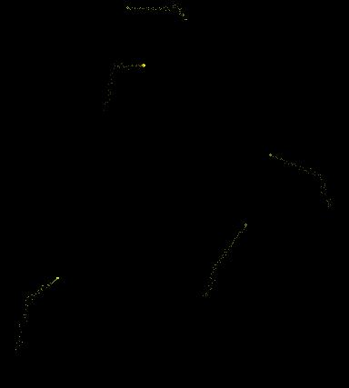

<div align="center">

## A Good thing for a screen saver \- Random Movement AI \- Fire Flies With Trails


</div>

### Description

This is a really REALLY cool screen saver type thing that I made. It's cool cause there are a bunch of different directions that the fire flies can move in. I also used some like a free fall, floating, random movement, and a cool sine function one too. Check this out though, because it's one of my favorite things I've ever made. Ask about anything that doesn't work or any bugs, please rate, thanx~

~Jason Ryczek
 
### More Info
 


<span>             |<span>
---                |---
**Submitted On**   |
**By**             |[Jason Ryczek](https://github.com/Planet-Source-Code/PSCIndex/blob/master/ByAuthor/jason-ryczek.md)
**Level**          |Beginner
**User Rating**    |4.0 (12 globes from 3 users)
**Compatibility**  |VB 6\.0
**Category**       |[Graphics](https://github.com/Planet-Source-Code/PSCIndex/blob/master/ByCategory/graphics__1-46.md)
**World**          |[Visual Basic](https://github.com/Planet-Source-Code/PSCIndex/blob/master/ByWorld/visual-basic.md)
**Archive File**   |[](https://github.com/Planet-Source-Code/jason-ryczek-a-good-thing-for-a-screen-saver-random-movement-ai-fire-flies-with-trails__1-22859/archive/master.zip)


### Source Code

```
' These things look like little pixeys so that's
' what I named them. Although, they also look like
' fire flies, so whatever works. Enjoy!!!
' ~Jason Ryczek - CCguy7@aol.com
' PS -
' you can have the form as whatever you want, but
' it looks the best maximized
Dim PixX(4) As Integer, PixY(4) As Integer
Dim TrailX(4, 50) As Integer, TrailY(4, 50) As Integer
Dim Sx(4) As Integer, Sy(4) As Integer
Dim RnN As Integer
Dim spd As Integer
Dim freefall As Boolean
Private Sub Form_Load()
Dim a As Integer
Randomize Timer
For a = 0 To 4
  PixX(a) = (Me.ScaleWidth / (a + 1)) + Rnd(Me.ScaleWidth / 2)
  PixY(a) = (Me.ScaleHeight / (a + 1)) + Rnd(Me.ScaleWidth / 2)
Next
PixeyWonderAround Round((Rnd * 24) + 1, 0)
spd = 5
Me.BackColor = vbBlack
Me.ClipControls = False
Me.AutoRedraw = True
Timer1.Enabled = True
Timer1.Interval = 1
Timer2.Enabled = True
Timer2.Interval = 2000 + (Rnd * 2000)
freefall = False
End Sub
Private Sub Form_MouseDown(Button As Integer, Shift As Integer, x As Single, Y As Single)
Dim a As Integer
a = MsgBox("Are you sure you want to end?", vbYesNo)
If a = 6 Then End
End Sub
Private Sub Timer1_Timer()
Me.Cls
Dim a As Integer
Dim yelVal As Integer
PixeyWonderAround RnN
For a = 0 To 4
PixX(a) = PixX(a) + Sx(a): PixY(a) = PixY(a) + Sy(a)
If (PixX(a) < 0) Or (PixX(a) > Me.ScaleWidth) Then PixX(a) = Me.ScaleWidth * Rnd
If freefall = False Then
  If (PixY(a) < 0) Or (PixY(a) > Me.ScaleHeight) Then PixY(a) = Rnd(Me.ScaleHeight / 2)
Else
  If PixY(a) > Me.ScaleHeight Then Sy(a) = Sy(a) + -0.8
End If
Dim i As Integer
For i = 50 To 1 Step -1
  yelVal = Rnd * 200 + 55
  TrailX(a, i) = TrailX(a, i - 1) + Rnd * 10 - Rnd * 10: TrailY(a, i) = TrailY(a, i - 1) + Rnd * 10 - Rnd * 10 + 10
  TrailX(a, 0) = PixX(a): TrailY(a, 0) = PixY(a)
  Me.PSet (TrailX(a, i), TrailY(a, i)), RGB(((yelVal / 5) * ((a + 1) / 2) + 55) / (a + 1), (yelVal / 5) * ((a + 1) / 2) + 55, 5 - a)
Next
Me.Circle (PixX(a), PixY(a)), 10 * Rnd + 10, RGB(Rnd * 100 + 155, Rnd * 100 + 155, 0)
Next
End Sub
Private Sub Timer2_Timer()
RnN = Round((Rnd * 24) + 1, 0)
Timer2.Interval = 2000 + Round((Rnd * 2000), 0)
End Sub
Sub PixeyWonderAround(ByVal rndNum As Integer)
Select Case rndNum
  Case 1
    freefall = False
    Sx(0) = -20 - Rnd * 10: Sy(0) = 0
    Sx(1) = 20 - Rnd * 10: Sy(1) = 10
    Sx(2) = -20 - Rnd * 10: Sy(2) = 10
    Sx(3) = 20 - Rnd * 10: Sy(3) = 0
    Sx(4) = -20 - Rnd * 10: Sy(4) = -10
  Case 2
    freefall = False
    Sx(0) = 20 - Rnd * 10: Sy(0) = 10
    Sx(1) = -20 - Rnd * 10: Sy(1) = 0
    Sx(2) = 20 - Rnd * 10: Sy(2) = -10
    Sx(3) = -20 - Rnd * 10: Sy(3) = 10
    Sx(4) = 20 - Rnd * 10: Sy(4) = 0
  Case 3
    freefall = False
    Sx(0) = -20 - Rnd * 10: Sy(0) = 0
    Sx(1) = -20 - Rnd * 10: Sy(1) = -20
    Sx(2) = -20 - Rnd * 10: Sy(2) = 20
    Sx(3) = -20 - Rnd * 10: Sy(3) = -20
    Sx(4) = -20 - Rnd * 10: Sy(4) = 0
  Case 4
    freefall = False
    Sx(0) = 0 - Rnd * 10: Sy(0) = -10
    Sx(1) = 20 - Rnd * 10: Sy(1) = -20
    Sx(2) = -20 - Rnd * 10: Sy(2) = 10
    Sx(3) = 0 - Rnd * 10: Sy(3) = 10
    Sx(4) = -20 - Rnd * 10: Sy(4) = 0
  Case 5
    freefall = False
    Sx(0) = -20 - Rnd * 10: Sy(0) = 20
    Sx(1) = 20 - Rnd * 10: Sy(1) = 10
    Sx(2) = -20 - Rnd * 10: Sy(2) = 10
    Sx(3) = 20 - Rnd * 10: Sy(3) = 10
    Sx(4) = -20 - Rnd * 10: Sy(4) = 0
  Case 6
    freefall = False
    Sx(0) = 20 - Rnd * 10: Sy(0) = 10
    Sx(1) = 20 - Rnd * 10: Sy(1) = 10
    Sx(2) = 20 - Rnd * 10: Sy(2) = 0
    Sx(3) = -20 - Rnd * 10: Sy(3) = 10
    Sx(4) = -20 - Rnd * 10: Sy(4) = 20
  Case 7
    freefall = False
    Sx(0) = -20 - Rnd * 10: Sy(0) = 20
    Sx(1) = -20 - Rnd * 10: Sy(1) = 10
    Sx(2) = 20 - Rnd * 10: Sy(2) = 0
    Sx(3) = 20 - Rnd * 10: Sy(3) = 10
    Sx(4) = 20 - Rnd * 10: Sy(4) = 20
  Case 8
    freefall = False
    Sx(0) = -20 - Rnd * 10: Sy(0) = 0
    Sx(1) = 20 - Rnd * 10: Sy(1) = 10
    Sx(2) = 20 - Rnd * 10: Sy(2) = 20
    Sx(3) = 20 - Rnd * 10: Sy(3) = 10
    Sx(4) = -20 - Rnd * 10: Sy(4) = 10
  Case 9
    freefall = False
    Sx(0) = -20 - Rnd * 10: Sy(0) = 0
    Sx(1) = 20 - Rnd * 10: Sy(1) = 10
    Sx(2) = 20 - Rnd * 10: Sy(2) = 20
    Sx(3) = 20 - Rnd * 10: Sy(3) = 10
    Sx(4) = -20 - Rnd * 10: Sy(4) = 10
  Case 10
    freefall = False
    Sx(0) = -20 - Rnd * 10: Sy(0) = 10
    Sx(1) = -20 - Rnd * 10: Sy(1) = 10
    Sx(2) = -20 - Rnd * 10: Sy(2) = 10
    Sx(3) = -20 - Rnd * 10: Sy(3) = 10
    Sx(4) = -20 - Rnd * 10: Sy(4) = 10
  Case 11
    freefall = False
    Sx(0) = 20 - Rnd * 10: Sy(0) = 5
    Sx(1) = 20 - Rnd * 10: Sy(1) = 10
    Sx(2) = 20 - Rnd * 10: Sy(2) = 15
    Sx(3) = 20 - Rnd * 10: Sy(3) = 20
    Sx(4) = 20 - Rnd * 10: Sy(4) = 25
  Case 12 To 14 ' Special Fall
    freefall = True
    Sx(0) = 10: Sy(0) = (Sy(0) + 1)
    Sx(1) = 10: Sy(1) = (Sy(1) + 1)
    Sx(2) = 10: Sy(2) = (Sy(2) + 1)
    Sx(3) = 10: Sy(3) = (Sy(3) + 1)
    Sx(4) = 10: Sy(4) = (Sy(4) + 1)
  Case 15 To 17 ' Special Float
    freefall = False
    Sx(0) = 10: Sy(0) = (Sy(0) - 1)
    Sx(1) = -10: Sy(1) = (Sy(1) - 1)
    Sx(2) = 10: Sy(2) = (Sy(2) - 1)
    Sx(3) = -10: Sy(3) = (Sy(3) - 1)
    Sx(4) = 10: Sy(4) = (Sy(4) - 1)
  Case 18 To 20 ' Special Sine Thingy
    freefall = False
    For a = 0 To 4
      Sx(a) = Sx(a) + spd: Sy(a) = 180 * Sin(Sx(a) * 45)
      If (Sx(a) > 100) Or (Sx(a) < 1) Then spd = -spd
    Next
  Case 21 To 25 ' Totally Random
    freefall = False
    Sx(0) = Rnd * 20 - (Rnd * 20): Sx(0) = Rnd * 20 - (Rnd * 20)
    Sx(1) = Rnd * 20 - (Rnd * 20): Sx(1) = Rnd * 20 - (Rnd * 20)
    Sx(2) = Rnd * 20 - (Rnd * 20): Sx(2) = Rnd * 20 - (Rnd * 20)
    Sx(3) = Rnd * 20 - (Rnd * 20): Sx(3) = Rnd * 20 - (Rnd * 20)
    Sx(4) = Rnd * 20 - (Rnd * 20): Sx(4) = Rnd * 20 - (Rnd * 20)
End Select
End Sub
```

